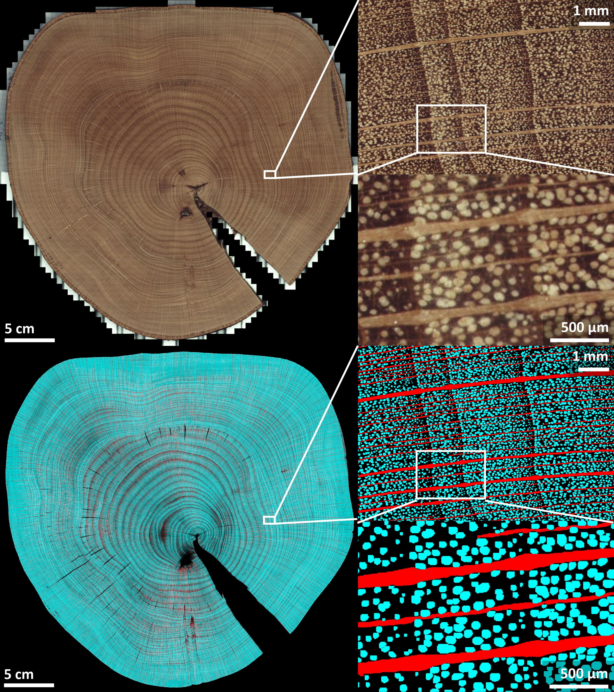

<p align="center">
  
</p>
<p align="center">
    <h1 align="center">YoloAnatomy</h1>
</p>


[Verschuren, Louis](https://orcid.org/0000-0002-3102-4588)[^aut][^cre][^UG-WL];
[Van den Bulcke, Jan](https://orcid.org/0000-0003-2939-5408)[^aut][^UG-WL];
[Wyffels, Francis](https://orcid.org/0000-0002-5491-8349)[^aut][^^AI-RO];

[^aut]: author
[^cre]: contact person
[^UG-WL]: UGent-Woodlab
[^AI-RO]AI and Robotics Lab, IDLab-AIRO


<p align="left">
   This is the repository for a Python routine which is used to train a YOLOv8 deep learning segmentation model and subsequently uses it to do fully automated analysis of gigapixel sized images, here exemplified for the quantification of vessels and rays on full disc surfaces and increment cores. 
</p>


<p align="center">
	<!-- local repository, no metadata badges. --></p>
<p align="center">
		<em>Built with the tools and technologies:</em>
</p>
<p align="center">
	
	
		
</p>
<br>

#####  Table of Contents

- [ Crop images](#crop-images-crop-imagesipynb)
- [ Model training](#model-training-yolo8-vessel-detector-trainipynb)
- [ Image analysis](#image-analysis-sliding-window-yolov8-maskipynb)
- [ Getting Started](#getting-started)
- [ Cite our work](#cite-our-work)
- [ License](#license)

---

##  Crop images: crop-images.ipynb
This will take all images from a specified folder and crops them to 640 x 640 images which can be used for annotation. 640 x 640 is the standard image size for YOLOv8. 

---

## Model training: yolo8-vessel-detector-train.ipynb
This will train a YOLOv8 segentation model from an annotated training dataset. Training data can be created using [Roboflow](https://roboflow.com/). Depening on the datset size and application, different augmentation parameters can be chosen.

---

## Image analysis: sliding window Yolov8 mask.ipynb
This segments all images in a specified folder using a trained YOLOv8 model. It creates binary masks for each of the classes in the model. This code can also count individual detections of objects, like individual vessels, and removes double detections. It uses a sliding window approach with a user defined overlap percentage. 

---

## Getting started

Before running the notebooks, ensure that you have the following dependencies installed:
- from ultralytics import YOLO
- os
- from PIL import Image
- numpy
- torch
- cv2
- from pyometiff import OMETIFFReader
- sys
- from torchvision.ops import nms
- math

A trained network example and accompanying training data are available on [Zenodo](http://google.com).

---

## Cite our work

You can find the paper where the model is discribed [here](http://google.com), cite our work with the following bibtex snippet:

```tex
TODO
```

---

##  License

This software is protected under the [GNU AGPLv3](https://choosealicense.com/licenses/agpl-3.0/) license. The images and trained models are protected under the [CC BY-NC 4.0](https://creativecommons.org/licenses/by-nc/4.0/) license. 

---
